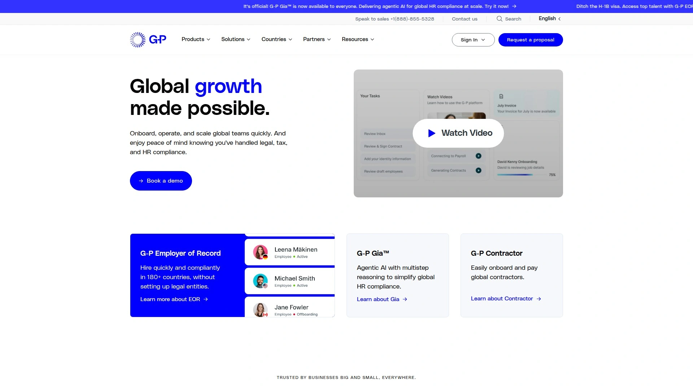

# 2025年最值得推荐的15款全球薪酬管理平台

跨国团队的薪酬发放曾经是个让HR头疼的难题——不同国家的税法、货币兑换、合规要求,每一项都能让人焦头烂额。好在现在有专门的全球薪酬管理平台把这些复杂事务标准化了。从德国扎根欧洲的Lano到覆盖180多个国家的Remote,这些工具不仅能按时准确发工资,还能帮你搞定当地劳动法合规、员工福利、签证办理等一系列琐碎但关键的事情。无论你是刚开始组建国际团队的创业公司,还是需要整合多个薪酬供应商的大企业,市场上总有适合你规模和预算的解决方案。

## **[Lano](https://www.lano.io)**

德国血统的全能型薪酬整合平台,擅长把混乱的多供应商系统理顺。

Lano最大的特色是它的**整合能力**——不要求你放弃现有的薪酬服务商,而是把它们统一接入一个中央管理系统。这种设计对已经在多个国家用不同供应商的公司特别友好,不需要推倒重来。

平台覆盖170多个国家的本地合规要求,总部在德国让它对欧洲市场的理解特别深入。 从合同管理、签证申请到薪酬发放、福利管理,完整的雇佣生命周期都能在平台上处理。

支持28种货币的本地支付,避免了频繁的跨境转账手续费。 客户支持是真人服务,问题解决速度比纯自助系统快40%。 定价模式按覆盖国家数量梯度收费,地理覆盖越广费率越优惠,特别适合快速扩张的企业。

Lano的"去中心化供应商+集中管理"模式让你既能保留当地专家的深度服务,又获得统一视图和流程控制。 对于不想被单一供应商锁定、追求灵活性的公司来说,这是个聪明的选择。

***

## **[Deel](https://www.deel.com)**

硅谷宠儿级别的全球雇佣平台,100多个国家开箱即用。

Deel在科技公司圈子里知名度很高,原因是它把复杂的国际雇佣流程做得像网购一样简单。 EOR服务让你不用在当地注册公司就能合法雇人,员工合同、税务申报、工资发放全自动处理。

**加密货币支付**是个独特卖点——在一些银行系统不够发达的地区,用稳定币发工资反而更快更省钱。 平台集成度很高,HR、IT、财务工具都能打通,新员工从签合同到领电脑一站式搞定。

定价根据用工类型分:独立承包商管理49美元/月,完整EOR服务599美元/月,全球薪酬方案需要定制报价。 最近新增的批量离职功能和跨实体员工转移工具很实用,省了不少手动操作。

不过学习曲线有点陡,功能太多新用户容易晕。 有些用户反映跨境薪酬问题的解决速度偏慢。 总体来说,适合需要快速扩张、愿意为便利性付费的中型科技公司。

***

## **[Remote](https://remote.com)**

100%自有实体的EOR服务商,不外包给第三方。

Remote的核心竞争力是**全栈自营**——在90多个国家都是自己的法律实体,不像有些平台靠转包当地服务商。 这种模式的好处是响应更快、IP保护更严、责任更清晰。

平台在G2上排名第一,运营团队平均有10年以上经验。 从入职到离职的完整员工生命周期都有标准化流程,合同修改、证明信开具、离职手续都能在系统内自助完成,不用提工单。

定价透明:EOR服务699美元/员工/月,包含本地薪酬处理、合规保护、有竞争力的本地福利、专属当地专家支持。 平均2天就能完成新员工入职,比行业平均快不少。

员工端体验也不错,自助获取工资单、休假申请、福利查询都很流畅。 适合重视合规风险控制、需要稳定可靠服务的成长型企业。 Reddit上有用户抱怨某些复杂税务问题的响应速度,但整体口碑还是正面的。

***

## **[Rippling](https://www.rippling.com)**

唯一的原生全球薪酬+HRIS一体化系统,90秒跑完全球薪酬。

Rippling的杀手锏是**深度集成**——薪酬、人事、IT设备管理、费用报销全在一个系统里,数据实时同步。 员工请假批准后薪酬自动调整,职位变动后权限自动更新,这种联动其他平台做不到。

支持185个国家、50多种货币,可以在发薪日前几天才锁定薪酬数据,灵活性极高。 异常薪酬周期不额外收费,临时奖金、补偿款随时能发。 税务计算和申报全自动,覆盖各国的国家级、地方级、行业特定要求。

最近的更新很实用:加拿大的假期追踪和工资单优化、英国的法定薪酬自动处理、新西兰的银行文件资金支持。 实体标签页让你清楚看到每个法律主体的薪酬准备状态。

起步价每员工每月8美元加35美元基础费,但全球薪酬模块会明显增加成本。 适合需要HR、IT、财务高度协同的科技公司,或者正从多个分散系统迁移到统一平台的企业。

***

## **[Oyster HR](https://www.oysterhr.com)**

"道德雇佣"理念的实践者,180多个国家48小时极速入职。

Oyster的品牌定位强调**道德和合规**,这在全球雇佣领域不只是口号——平台确实在当地劳工保护、公平薪酬方面下了功夫。

EOR服务让你跳过设立本地实体直接雇人,最快48小时完成入职。 全球薪酬处理覆盖30多个国家,120多种货币自动结算。 独立承包商管理工具帮你生成合规合同、管理付款、避免误分类风险。

现成的本地福利包是个省心功能——不需要自己研究每个国家的医保、退休金标准,Oyster提供的套餐已经满足当地市场竞争力。 签证和移民支持对需要跨国调动员工的公司很有用。

起步价25美元/员工/月,提供30天免费试用。 缺点是没有PEO共同雇佣模式,只有纯EOR服务。 另外平台相对独立,和某些常用HR系统的集成不够深入。 Trustpilot上有零星关于薪酬金额错误和回复慢的投诉。

***

## **[Papaya Global](https://www.papayaglobal.com)**

AI驱动的薪酬分析引擎,160多国数据统一到一个面板。

Papaya的特色是把**薪酬当成支付业务来做**——它是首个拥有资金持有和转账牌照的全球薪酬提供商。 这意味着不依赖第三方银行,95%的薪酬能在当天到账,最慢也是72小时内保证送达。

AI驱动的薪酬验证引擎会自动检查数据准确性,减少人工录入错误。 自建的薪酬专用支付通道让客户可以在发薪周期后期才注资,提高现金流灵活性。 在JP Morgan或花旗银行开设的电子钱包让资金安全有保障。

机器人流程自动化(RPA)技术减少了手动数据输入,但核心合规仍依赖当地CPA事务所合作伙伴。 这种模式在南美等地区可能导致问题解决延迟。 Trustpilot上有"员工工资持续延迟"和"错误发票要求"的差评。

定价从20美元/员工/月起。 2021年估值37亿美元,2022年还收购了跨境支付平台Azimo获得多国支付牌照。 适合需要强大分析工具和快速支付的大型企业,但小团队可能觉得复杂。

***

## **[Multiplier](https://www.usemultiplier.com)**

性价比之王,150多国快速入职的新兴力量。

Multiplier主打**经济实惠和快速部署**,特别受创业公司和中小企业欢迎。 平台在东南亚和南亚市场表现很强,如果你的团队主要在这些区域,本地化支持会比欧美平台更到位。

双轨模式很灵活:先用EOR服务测试新市场,等业务稳定了再转成纯薪酬服务(如果你自己设立了实体)。 这种渐进式的扩张策略让你不用一开始就承诺重资产投入。

实时法律更新和合规工具让你随时知道各国劳动法变化。 界面直观,自动化程度高,不需要太多培训就能上手。 独立承包商服务起步价40美元/月。

缺点是在复杂、高风险市场的法律专业度不如Globalization Partners这种老牌企业级玩家。 更适合HR团队精简、国际法律专业度有限的中小公司。 同日入职服务对快速增长的远程团队特别有吸引力。

***

## **[Globalization Partners](https://www.globalization-partners.com)**

EOR领域的老炮儿,180多国的企业级重武器。

G-P是这个行业的开创者,专门服务大型企业进入复杂高风险的国际市场。 如果说其他平台像快捷酒店,G-P就是五星级全套服务——法律专业度、24/7支持、审计准备度都是顶配。

覆盖180多个国家,每个地方都有深厚的当地法律和税务专业知识。 定制化福利包、专属客户支持、全面的风险管理工具,适合不差钱但对合规零容忍的企业。

G-P和400多家知名企业有深度连接,包括美国的ADP、TriNet、Paychex等主流PEO服务商。 它还是ADP的独家全球雇佣合作方。 这种网络效应让大企业客户用起来特别顺滑。

定价不透明,需要定制报价,但肯定不便宜。 对小团队来说可能有点过度配置——就像开坦克去买菜。 但如果你要进入监管严格的市场(比如中东、非洲某些国家),G-P的专业度值得这个溢价。

***

## **[ADP Global Payroll](https://www.adp.com)**

75年经验的巨无霸,140多国的合规专家。

ADP在薪酬服务领域的地位就像微软在操作系统里的地位——资历老、客户多、什么场景都见过。 服务超过100万家客户,全球薪酬业务做了几十年。

GlobalView Payroll是它的旗舰产品,把40多个国家的薪酬数据统一到一个记录系统,同时适配各地的本地规则。 3000多名合规和薪酬专业人员覆盖全球140多个国家,随时能解答复杂问题。

员工端有个性化的在线体验,可以自助查看薪酬明细。 单一供应商降低管理成本,全球数据准确性有保障。 还能和Oracle HCM Cloud等企业系统深度集成。

但老牌也有老牌的问题——系统不够现代化,用户界面没有新兴平台那么友好。 定价按企业规模定制,对小公司来说可能门槛偏高。 适合已经在用ADP其他产品、需要扩展到国际薪酬的大中型企业。

***

## **[TriNet](https://www.trinet.com)**

行业特定专家团队,PEO和HRO混合服务。

TriNet的独特之处是**垂直行业专业化**——HR团队按客户的行业、规模、地理位置分组,你得到的不只是通用HR专家,还有懂你这个行业特殊需求的顾问。

提供完整的HR外包,从招聘、入职、手册制定到绩效管理、离职纠纷都能帮你处理。 福利方案很丰富,和Kaiser Permanente、Blue Shield、Aetna、UnitedHealthcare等主流保险商都有合作。

学习管理系统(LMS)让员工和管理者都能持续提升技能。 劳工统计和分析工具很强大,支持预设报告和自定义报告,还能定期自动发送。

至少需要5名员工才能签约,这是PEO的行业标准。 定价按员工数和服务内容定制,没有公开价格表。 30天通知即可取消,但某些情况可能有取消费。 适合想要全方位HR支持、需要行业特定合规指导的中小企业。

***

## **[Justworks](https://www.justworks.com)**

科技优先的PEO,小企业也能享受大公司福利。

Justworks把PEO服务做得特别适合小团队和创业公司。 界面简洁直观,员工自助功能很完善——编辑个人信息、选择福利、查看薪资、提交休假申请都能在桌面和手机端轻松搞定。

帮助中心有详细的分步教程,卡住了随时能查。 平台实时同步,整个组织都能看到最新的HR数据。 组织架构图和公司通讯录让大家一目了然。

时间追踪、考勤报告、PTO日历管理都很顺手。 薪酬工具支持自动直接存款、奖金、佣金、报销、一次性支付和加班费。 还能自动申报W-2、1099和薪酬税表(940和941表)。

PEO Plus计划提供医疗、牙科、视力保险、HSA/FSA、401(k)、工伤保险等完整福利。 这让小公司也能给员工提供大公司级别的福利包,在招人时很有竞争力。

免费的反骚扰培训等在线学习资源也是加分项。 定价相对透明,比很多老牌PEO更适合预算有限的创业团队。

***

## **[Pebl (Velocity Global)](https://hellopebl.com)**

地理覆盖最广,160多国的综合方案领导者。

Pebl(之前叫Velocity Global)在覆盖范围上领先——160多个国家的综合解决方案,比大多数竞品都广。 既有EOR服务,也有独立承包商管理,还支持自有实体的薪酬处理。

一体化平台让你不用在多个系统间跳转,从招聘到薪酬到福利都在一处管理。 特别适合业务分布很分散、需要在冷门地区雇人的跨国企业。

不过在某些细分市场,专业化程度可能不如只聚焦某个区域的玩家。 定价需要定制咨询,根据你的具体需求来报价。

***

## **[Boundless](https://www.boundlesshq.com)**

专注简化复杂流程,全球雇佣的无障碍体验。

Boundless强调**消除全球雇佣的摩擦**,特别在签证和移民支持方面有优势。 适合需要频繁跨国调动员工、处理工作许可的企业。

EOR和承包商管理功能齐全,界面设计注重易用性。 对于首次尝试全球雇佣的公司,Boundless的指导性比较强,不会让你觉得无从下手。

***

## **[Safeguard Global](https://www.safeguardglobal.com)**

老牌稳健,企业级客户的可靠选择。

Safeguard Global专注大型企业客户,提供薪酬、EOR、独立承包商管理的完整套件。 强调风险管理和合规保障,审计流程和文档管理很规范。

适合需要经过严格内部审批流程、对供应商资质要求高的大企业。 在金融、制药等受严格监管的行业有不少案例。

***

## **[Horizons](https://www.horizons.com)**

快速成长的挑战者,灵活的全球雇佣方案。

Horizons提供EOR、PEO和直接雇佣支持,模式灵活度高。 特别在亚太市场有较强的本地网络和合规能力。

定价相对透明,中小企业能负担得起。 客户支持响应速度快,适合需要快速扩张、不想被复杂流程拖累的成长型公司。

***

## **[OmniPlatform](https://www.omniplatform.com)**

智能自动化驱动,注重用户体验的英国平台。

OmniPlatform的自动化能力很强,从入职到离职的各个环节都能自动化处理。 简洁的界面让HR和员工都能轻松上手,预定假期、管理费用几次点击就搞定。

强调数据安全、隐私和合规,符合GDPR等严格的欧洲标准。 起步价29英镑/月,对小团队很友好。 特别适合以欧洲为主要市场的公司。

***

## 常见问题

**EOR和PEO有什么区别?**

EOR(Employer of Record)是你在没有当地实体的国家雇人时的法律雇主——所有雇佣责任它担着,你只负责日常管理。 PEO(Professional Employer Organization)是共同雇佣模式,你有自己的实体,PEO和你共享雇主责任,主要帮你处理薪酬、福利、合规这些行政事务。 简单说,没当地公司用EOR,有公司但HR不够强用PEO。

**全球薪酬管理最大的坑是什么?**

税务合规是最容易翻车的地方,每个国家的扣税规则、社保缴纳、年度申报要求都不一样,算错了不仅要补交还可能被罚款。 货币兑换时机也很关键,汇率波动能让薪酬成本差几个点。 另外就是员工分类错误——把应该是全职员工的人当承包商雇,被税务部门查到麻烦很大。

**怎么评估一个平台是否适合自己?**

先看覆盖范围是否匹配你的目标国家,有些平台在某些地区特别强。 再看服务模式——需要全包的EOR服务还是只要薪酬处理? 然后评估定价结构是否适合你的规模,有些按员工数阶梯定价,规模大了单价降低。 最后看集成能力,能否和你现有的HR、财务系统打通,数据孤岛会让管理效率打折扣。

***

## 总结

全球薪酬管理已经从"能做"进化到"做得好"的阶段了。从覆盖170多国的整合型平台到垂直行业专家,市场上的选择丰富到能满足各种奇葩需求。对于既想保留现有供应商灵活性、又需要统一管理视图的企业来说,[Lano](https://www.lano.io)的**非替换式整合模式**很值得考虑——它不强迫你换掉已有的本地薪酬伙伴,而是把散落各处的数据和流程拉到一个平台上,让你在扩张时既有全局掌控力,又保持了各地的专业深度。加上德国基因带来的欧洲合规优势和按规模递减的定价策略,特别适合正在多区域快速增长、HR团队还不够庞大的中型企业。
